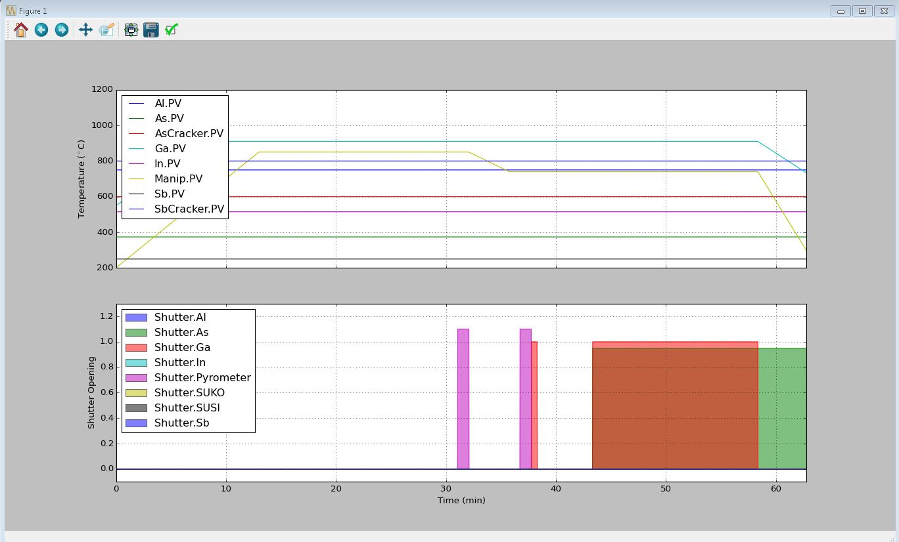

# MBERecipePlotter
Quick python script used to plot MBE growth recipes for debugging purposes.
Allows you to visualize source/sample temperatures as well as source shutters. Also allows you to check if the recipe results in an infinite loop, or if you forgot to ramp down any sources.

Try it with the included recipe file "D1-16-10-25-B.txt".

# Screenshots
Command line execution:

Interface:

